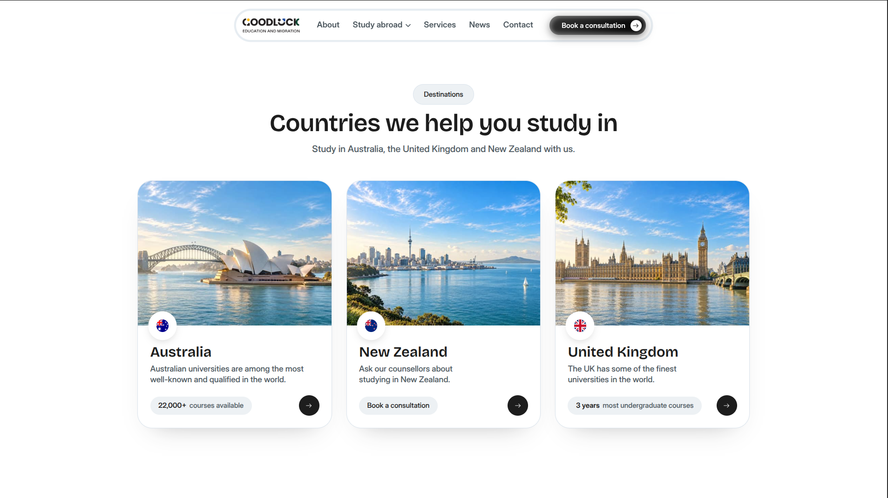

<p align="center">
  <picture>
    <source media="(prefers-color-scheme: dark)" srcset="apps/web/public/brand/logo-white.png" />
    
  </picture>
</p>

<h1 align="center">Goodluck Education & Migration</h1>

<p align="center">
  <strong>Study abroad, simplified.</strong> Choosing a country and a course, applying to
  universities and colleges, preparing visa paperwork, and coaching for the IELTS and PTE
  English tests.
</p>

<p align="center">
  <a href="https://goodluck.services/"></a>
  <a href="https://goodluck-silk.vercel.app/"></a>
</p>

## About

Goodluck runs three offices, Melbourne (head office), Butwal and Cebu. This repository is its
home on the web: destinations, services, institutions, courses, test preparation batches, news,
events, team and success stories, plus enquiry and consultation booking forms that send each
lead to the right office. Staff manage it all from a built-in admin panel at `/admin`.




---

## What it does

- **Public site.** Study destinations, services, institutions, courses, IELTS and PTE preparation,
  news, events, team, offices and success stories. The header picks the visitor's office from a
  saved choice or their timezone, and the office drives phone numbers, team and events.
- **Enquiries and consultations.** Forms post to the API, are bot-checked with Turnstile, rate
  limited, and emailed to the right office.
- **Admin panel** at `/admin`. Staff sign in with email and password. Roles scope what each
  person can see and edit: an admin manages users, a member does everything else, and a member
  with an office only sees that office.
- **Media.** Uploads go to Cloudinary. The static images under `public/` are served through the
  same CDN with automatic format and size.

---

## Tech stack

| Layer           |                                                                                                                                                          |
| --------------- | -------------------------------------------------------------------------------------------------------------------------------------------------------- |
| Framework       |   |
| Language        |                                                         |
| Styling         |                                                      |
| Database        |                                                                |
| ORM             |                                                                  |
| Auth            |                                                                        |
| Media           |                                            |
| Email           |                                                           |
| Bot protection  |                                                   |
| Backups         |  <br />*Not working right now*                         |
| Hosting         |                                                                  |
| Editor          |                                                                                           |
| Motion          |                         |
| Icons           |                                                                   |
| Tests           |                                                                   |
| Package manager |                                                                            |

---

## Layout

```
apps/web/        the Next.js app: routes, features, components, tests
packages/db/     @goodluck/db: schema, Neon client, migrations
```

`apps/web/src/features/` holds one folder per business area, each with its public queries,
admin queries, server actions and components. `packages/db/src/schema/` is the source of truth
for the database.

---

## Running it locally

Needs Node 22, pnpm 11 and a Neon branch for development.

```bash
pnpm install
cp apps/web/.env.example apps/web/.env.local   # then fill it in, DATABASE_URL being your dev branch
pnpm db:migrate:dev                            # apply every migration to that branch
pnpm dev
```

The app talks Neon's HTTP protocol, so there is no local Postgres. Development and production run
the same driver and the same client code against different branches of the same database.

---

## Commands

All of these run from the repository root.

| Command                  | What it does                                                              |
| ------------------------ | ------------------------------------------------------------------------- |
| `pnpm dev`             | Development server                                                        |
| `pnpm build`           | Production build, the same one Vercel runs                                |
| `pnpm typecheck`       | Types only, across both packages                                          |
| `pnpm lint`            | ESLint                                                                    |
| `pnpm test`            | Vitest. Database tests stand aside when`DATABASE_URL` is unset          |
| `pnpm db:migrate:dev`  | Apply every migration to the local database                               |
| `pnpm db:migrate:prod` | Apply pending migrations to production (by hand, with`.env.production`) |
| `pnpm assets:upload`   | Push`public/` images to Cloudinary. `--force` overwrites              |

---

## Deploying

Push to `main`. Vercel builds and releases the app from `apps/web`. Database changes are applied
by hand with `pnpm db:migrate:prod` (migrate before pushing code that needs it). CI runs
typecheck, lint, tests and a build on every pull request against the database named by the
`TEST_DATABASE_URL` secret.

---

## More

- `docs/`: setup and running notes for whoever owns the site (database, email, media,
  Google, admin use, recovery)
- `.agents/skills/update/SKILL.md`: the skill for agents working on this site. Say
  "/update" followed by the change in plain English.

---

## Credits

<table>
  <tr>
    <td align="center">
      <a href="https://github.com/prawesh-12">
        <br />
        <b>prawesh-12</b>
      </a><br />
      <sub>Designed and developed</sub>
    </td>
    <td align="center">
      <a href="https://github.com/sankalpaacharya">
        <br />
        <b>sankalpaacharya</b>
      </a><br />
      <sub>Reviewed</sub>
    </td>
  </tr>
</table>
